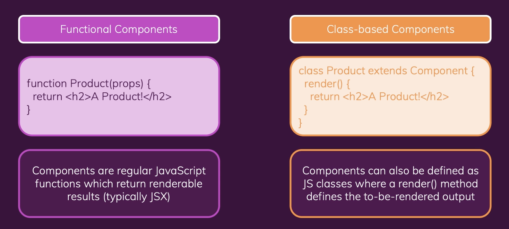

# Class-based Components

- 최근의 리액트 프로젝트는 클래스 기반 컴포넌트 개발 방식은 거의 사용하지 않음
- Traditionally (React < 16.8>), you had to use Class-based Components to manage "State"
- React 16.8 introduced "React Hooks" for Functional Components
- Class-based Components Can't use React Hooks!

<br>



<br>


### 1) 함수형 기반 컴포넌트 -> 클래스 기반 컴포넌트로 변경

```javascript
import { Component } from "react";
import classes from "./User.module.css";

class User extends Component {
  render() {
    return <li className={classes.user}>{this.props.name}</li>;
  }
}

// const User = (props) => {
//   return <li className={classes.user}>{props.name}</li>;
// };

export default User;

```