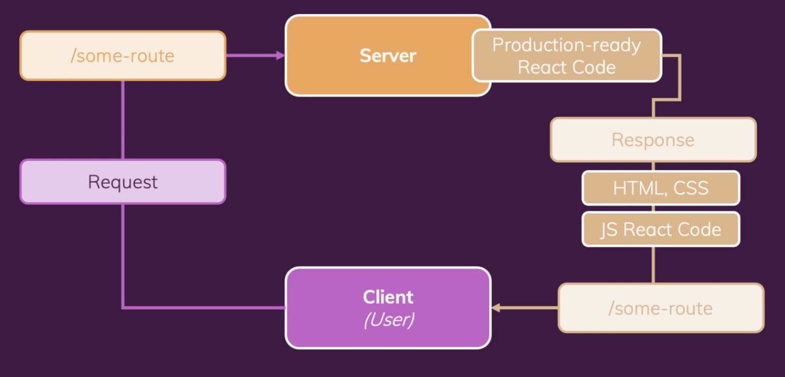

# 리액트 앱 배포하기

## 1) Deployment Steps
-   Test Code
-   Optimize Code
-   Build App for Production
-   Upload Production Code to Server
-   Configure Server

<br><br>

## 2) Lazy Loading
-   레이지 로딩은 해당 코드가 필요할 때만 그 특정 코드를 로딩하는 것이다. React 싱글 페이지 애플리케이션을 사용하면 결국 큰 자바스크립트 코드 번들을 빌드하게 되고 해당 사이트를 사용하려면 웹 사이트의 모든 방문자가 이 전체 번들을 다운로드 해야 한다.
-   즉, 우리 웹사이트 방문자는 코드가 다운로드 될 때까지 기다려야 한다. 따라서 다운로드 되는 이 초기 코드 번들을 가능한 한 작게 만들어야 한다.
-   코드를 여러 덩어리로, 여러 번들로 나누고 각각 필요할 때만 다운로드 하는 것이 이 개념의 핵심이다. 
-   라우팅을 사용하는 경우 해당 라우트를 방문할 때만 다운로드 되도록 할 수 있다.


-   React.lazy()를 통해 코드가 필요할 때만 다운로드 할 수 있다. 코드가 로딩되는데 시간이 조금 더 오래 걸리는 경우 <Suspense> 내의 <LoadingSpinner>가 fallback으로 전달된다.

<br>


```javascript
import React, { Suspense } from 'react';
import { Redirect, Route, Switch } from "react-router-dom";
import Layout from "./components/layout/Layout";
import LoadingSpinner from './components/UI/LoadingSpinner';
import QuotesDetail from "./pages/QuotesDetail";

const NewQuotes = React.lazy(() => import('./pages/NewQuotes'));
const QuotesDetail = React.lazy(()=> import ("./pages/QuotesDetail"));
const NotFound = React.lazy(()=> import("./pages/NotFound"));

function App() {
    return (
        <Layout>
            <Suspense fallback={
                <div className='centered'>
                    <LoadingSpinner/>
                </div>
            }>
                <Switch>
                    <Route path="/" exact>
                        <Redirect to="/quotes" />
                    </Route>
                    <Route path="/quotes" exact>
                        <AllQuotes />
                    </Route>
                    <Route path="/quotes/:quoteId">
                        <QuotesDetail />
                    </Route>
                    <Route path="/new-quotes">
                        <NewQuotes />
                    </Route>
                    <Route path="*">
                        <NotFound />
                    </Route>
                </Switch>
            </Suspense>
        </Layout>
    );
}

export default App;
```

<br>

-   사용자가 이 페이지를 방문할 것이라고 생각된다면 lazyLoading은 불필요하다. 물론 선택 사항이겠지만, 페이지가 많고 각 페이지에 많은 컴포넌트와 많은 복잡한 로직이 붙어있는 애플리케이션에서는 레이지 로딩이 진가를 발휘한다. 웹사이트의 초기 로딩을 훨씬 빠르게 만들어준다.

<br><br>

## 3) 배포 시작하기
-   A React SPA is a "Static Website". 따라서 HTML과 CSS, 자바스크립트 코드로만 구성된다.
-   리액트 싱글사이드 앱을 배포하고 싶으면 정적 사이드 호스트가 필요하다. hosting a static website가 필요함
-   이 프로젝트에서는 Firebase의 Hosting 서비스를 사용한다.

<br>

```
$ npm install -g firebase-tools 
$ firebase login
$ firebase init
```

<br>

-   CLI로 작업을 진행하다 보면, 'What do you want to use as your public directory ? (public)' 이라고 물어보게 되는데 우리가 실제로 배포해야 되는 파일은 build 폴더에 있으므로 디폴트인 public 폴더로 하지 않고, build를 입력한다.
-   Configuration as single-page app (rewirte all urls to /index.html)?(y/N) y

<br><br>

## 4) Configure Server
-   서버에 도달한 request는 path를 포함하고 있고, 전체 URL을 포함한다. 
-   그리고 디폴트로 서버는 다른 파일을 찾고, 다른 URL의 응답으로 리턴될 것이다. 그런 식으로 서버가 작동한다.
-   하지만 싱글 페이지 앱을 호스트 할 때는 path를 무시하고 싶다. 서버에 있는 도메인 뒤의 path는 사용자가 어떤 경로를 타켓하는지 상관없이 항상 같은 HTML 파일, 같은 자바스크립트 파일을 응답한다. 
-   그럼 리액트 앱과 앱의 일부인 리액트 라우터는 다른 URL을 찾을 것이다. 그리고 알맞은 콘텐츠를 스크린에 렌더한다.
-   따라서 서버는 아래 그림의 /some-route 경로를 무시해야 한다. 서버는 디폴트로 request path를 무시하지 않으므로 특정 호스트 제공 업체의 문서를 살펴야 한다.
-   파이어베이스의 'Configuration as single-page app (rewirte all urls to /index.html)? (y/N)' 이 질문이 그런 역할이다. 모든 URL이 인덱스 HTML로 다시 쓰여야 한다면 어떤 종류의 URL이 보내졌는지와는 관계 없이 우리는 항상 같은 HTML 파일을 리턴해야 한다. 따라서 이 질문에 y를 입력하면 파이어베이스가 알아서 설정해준다.
-   URL과 URL에 있는 path가 무시되도록 서버에서 설정하면 항상 싱글 페이지 앱 코드를 리턴할 것이다.
<br>



<br><br>


## 5) 배포

```
$ firebase deploy
```