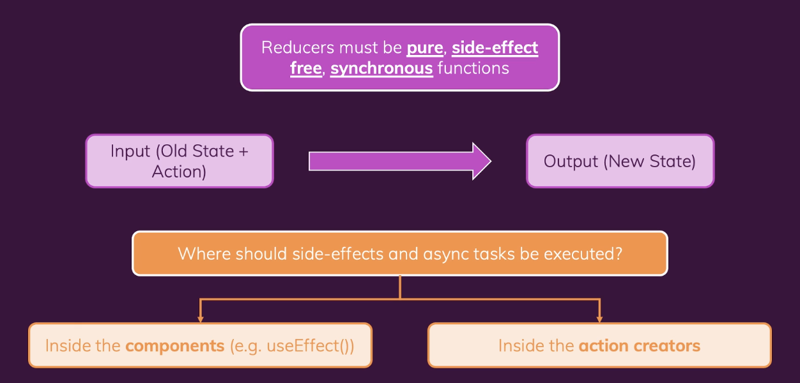

# 리덕스 고급

## 1) 리덕스 복습

-   https://github.com/yoojh9/udemy-course-react/tree/37d466d533f02b5fba669dde6260c7713a13859f/dive-deeper-redux

<br><br>

## 2) Side Effects, Async Tasks & Redux

-   Reducer 함수는 순수한 함수여야 한다. side-effect은 없어야 하고, async가 아닌 synchronous 함수여야 한다.
-   그렇지만 이는 리덕스로 작업할 때 보내야하는 HTTP 요청과 같이 side-effect가 발생하는 일부 작업은 어디에 넣어야 하며, 리덕스로 작업할 때 발생하는 비동기 코드를 어디에 넣어야 하는지 의문이 생긴다.
-   리듀서 함수 안에서는 비동기 코드를 실행하지 않아야 한다.

<br>



<br>

### (1) useEffect 사용하기

```javascript
// App.js

import { useEffect } from "react";
import { useSelector } from "react-redux";
import Cart from "./components/Cart/Cart";
import Layout from "./components/Layout/Layout";
import Products from "./components/Shop/Products";

function App() {
    const showCart = useSelector((state) => state.ui.cartIsVisible);
    const cart = useSelector((state) => state.cart);

    useEffect(() => {
        fetch(
            "https://react-http-1c05f-default-rtdb.firebaseio.com/cart.json",
            {
                method: "PUT",
                body: JSON.stringify(cart),
            }
        );
    }, [cart]);

    return (
        <Layout>
            {showCart && <Cart />}
            <Products />
        </Layout>
    );
}

export default App;
```

<br>

-   https://github.com/yoojh9/udemy-course-react/commit/6ff16412fa1935fecda87c5a7e1109d4fdde1833

<br>

-   https://github.com/yoojh9/udemy-course-react/blob/f4d0d0abc76d4e595e0ce85d8a3ccaf293f3cc65/dive-deeper-redux/src/App.js

<br>

### (2) 액션 생성자 Thunk 사용하기

-   Thunk란 action을 지연시키는 함수이다.
-   action 객체를 즉시 반환하지 않는 action creator를 작성하기 위해 Thunk로 action creator를 작성할 수 있다.
-

<br>

```javascript
// App.js

import { useEffect } from "react";
import { useDispatch, useSelector } from "react-redux";
import Cart from "./components/Cart/Cart";
import Layout from "./components/Layout/Layout";
import Products from "./components/Shop/Products";
import Notification from "./components/UI/Notificiation";
import { sendCartData } from "./store/cart-slice";

let isInitial = true;

function App() {
    const dispatch = useDispatch();
    const showCart = useSelector((state) => state.ui.cartIsVisible);
    const cart = useSelector((state) => state.cart);
    const notification = useSelector((state) => state.ui.notification);

    useEffect(() => {
        if (isInitial) {
            isInitial = false;
            return;
        }
        dispatch(sendCartData(cart));
    }, [cart, dispatch]);

    return (
        <>
            {notification && (
                <Notification
                    status={notification.status}
                    title={notification.title}
                    message={notification.message}
                />
            )}
            <Layout>
                {showCart && <Cart />}
                <Products />
            </Layout>
        </>
    );
}

export default App;
```

<br>

```javascript
// store/cart-slice.js

import { createSlice } from "@reduxjs/toolkit";
import { uiActions } from "./ui-slice";

const cartSlice = createSlice({
    name: "cart",
    initialState: {
        items: [],
        totalQuantity: 0,
    },
    reducers: {
        add(state, action) {
            const newItem = action.payload;
            const existingItem = state.items.find(
                (item) => item.id === newItem.id
            );
            state.totalQuantity++;
            if (!existingItem) {
                state.items.push({
                    id: newItem.id,
                    name: newItem.title,
                    price: newItem.price,
                    quantity: 1,
                    totalPrice: newItem.price,
                });
            } else {
                existingItem.quantity++;
                existingItem.totalPrice += newItem.price;
            }
        },
        remove(state, action) {
            const id = action.payload;
            const existingItem = state.items.find((item) => item.id === id);
            state.totalQuantity--;
            if (existingItem.quantity === 1) {
                state.items = state.items.filter((item) => item.id !== id);
            } else {
                existingItem.quantity--;
                existingItem.totalPrice -= existingItem.price;
            }
        },
    },
});

// 리듀서 함수가 아닌 별도 javascript 함수임
export const sendCartData = (cartData) => {
    return async (dispatch) => {
        dispatch(
            uiActions.showNotification({
                status: "pending",
                title: "Sending...",
                message: "Sending cart data!",
            })
        );

        const sendRequest = async () => {
            const response = await fetch(
                "https://react-http-1c05f-default-rtdb.firebaseio.com/cart.json",
                {
                    method: "PUT",
                    body: JSON.stringify(cartData),
                }
            );
            if (!response.ok) {
                throw new Error("Sending cart data failed");
            }
        };

        try {
            await sendRequest();

            dispatch(
                uiActions.showNotification({
                    status: "success",
                    title: "Success...",
                    message: "Sent cart data successfully",
                })
            );
        } catch (error) {
            dispatch(
                uiActions.showNotification({
                    status: "error",
                    title: "Error...",
                    message: error.message,
                })
            );
        }
    };
};

export const cartActions = cartSlice.actions;

export default cartSlice.reducer;
```
