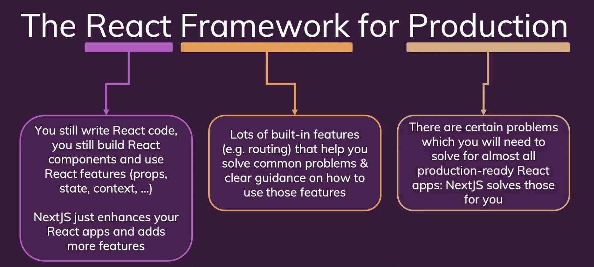

# Introducing NextJS

<br>

## 1) NextJS는 무엇인가
-   The React Framework for Production
-   A **fullstack** framework for ReactJS
-   프레임워크가 라이브러리보다 더 크고 기능이 많다. 프레임워크는 코드를 작성하는 방법이나 파일을 구성하는 방법에 관한 명확한 지침이 있다.
-   NextJS solves common problems and makes building React apps easier!
-   NextJS는 원래는 스스로 리액트 앱에 추가했어야 할 여러 핵심 기능들을 추가해서 React를 강화한다. (ex. 라우팅)
-   NextJS는 React 앱에 많은 기능을 간단히 추가한다. NextJS를 사용하면 쓸데없는 곳에 시간을 쏟을 필요가 없다.

<br>



<br><br>

## 2) 주요 기능

### (1) Server-side Rendering (SEO 향상)

-   Client-side Rendering은 데이터 로드 시 아주 잠깐 페이지가 깜빡인다. 데이터 fetching은 자바스크립트 코드가 실행될 때만 시작하기 때문이다.
-   검색 엔진 최적화가 중요하다면 Client-side Rendering은 역시 문제가 될 수 있다. 물론 모든 사이트에서 문제가 되는 것은 아니다. 로그인을 해야만 볼 수 있는 관리 대시보드인 경우에는 검색 엔진 최적화가 중요하지 않다.
-   하지만 검색 엔진으로 찾아야 하는 콘텐츠가 많이 있는 공개 페이지인 경우에는 검색 엔진 최적화(SEO)가 중요하다.
-   Client-side Rendering일 경우 검색 엔진 크롤러는 서버에서 들어온 비어있는 초기 HTML만 보게 된다. 
-   Server-side Rendering은 서버에서 해당 페이지를 사전 렌더링한 상태에서 서버에서 요청이 들어왔을 때 해당 데이터를 서버에서 가져오면 완성된 페이지가 사용자와 검색 엔진 크롤러에 제공된다. 그러면 사용자는 깜빡이는 로딩 상태를 보지 않아도 되고 검색 엔진도 해당 페이지 콘텐츠를 보게 된다. 이렇게 서버 사이드 렌더링으로 문제를 해결할 수 있다.
-   다시 말해 React 페이지, React 컴포넌트를 사전 렌더링할 수 있는 것이다.
-   중요한 점은 NextJS를 이용하면 초기 요청으로 읽어 들인 후에도 여전히 브라우저에서 기본 React 앱과 기본 싱글 페이지 애플리케이션을 실행할 수 있다는 사실이다.

<br>

### (2) 파일 기반 라우팅으로 라우팅 간소화
-   라우팅이란 사용자에게 여러 페이지가 있는 것처럼 착각하게 하는 것이다. 탐색하고 다른 페이지를 로딩하는 것이 라우터의 역할이다.
-   보통은 리액트 라우터 라이브러리를 사용한다. 이 라우터는 기본적으로 URL을 감시하다가 URL이 바뀌면 백엔드 서버에 요청을 보내는 브라우저의 기본 동작을 막고 대신 React를 사용하여 페이지에 다른 콘텐츠를 렌더링한다.
-   NextJS는 이러한 코드 내 라우트 정의를 없앤다. 대신에 NextJS로 파일과 폴더를 이용해서 페이지와 라우트를 정의한다. 이렇게 라우팅 코드를 작성하지 않아도 되므로 작업량을 줄일 수 있다.

<br>

### (3) 풀스택 프레임워크
-   NextJS를 사용하면 개발자가 React 프로젝트에 백엔드 코드를 쉽게 추가할 수 있다.
-   NextJS에서는 NodeJS 코드를 이용해서 React 프로젝트에 백엔드 API를 쉽게 추가할 수 있다.
-   이런 방식으로 코들르 추가해서 데이터베이스나 파일에 데이터를 저장하거나 데이터를 받아오거나 인증을 추가하는 등 모든 작업을 할 수 있다. 그러면 독립적으로 REST API 서버를 구축하지 않아도 된다.
-   하나의 프로젝트, 즉 Next 프로젝트에 클라이언트 쪽 코드와 React 사용자 인터페이스를 추가하고 백엔드 API 코드와 혼합하면 된다.

<br><br>

## 3) 새로운 Next.js 프로젝트 및 앱 만들기

-   Node.js(+npm) 설치

-   Setup

<br>

```
$ npx create-next-app
```

<br><br>

## 4) 첫 페이지 추가하기

-   \/로 요청 시 pages/index.js 파일을 불러오고, \/news로 요청 시 pages/news.js 파일을 불러온다. 즉 index.js 말고 다른 파일 이름은 경로 이름으로 사용된다.
-   \/ : pages/index.js
-   \/news: pages/news.js

<br><br>

## 5) 중첩 경로 및 페이지 추가하기 (중첩 경로)
-   \/news: pages/news/index.js 이렇게 구성해도 된다. pages 폴더 안에 만든 폴더도 경로 segment에 들어간다.
-   \/news/something-important: /pages/news/something-important.js

<br><br>

## 6) 동적 페이지 만들기

-   \/news/:id : pages/[newsId].js

<br><br>

## 7) 페이지 간 연결하기
-   사전 렌더링한 페이지가 있으면 사용자가 사이트를 처음 방문할 때 콘텐츠가 바로 보이고 검색 엔진 관점에서도 좋지만, 사용자가 이미 페이지에 들어온 상태에서 navigate를 한다면 싱글 페이지 애플리케이션을 유지하는 것이 좋다. 그러면 페이지 전체에 걸쳐 상태를 보존하면서도 더 빠르게 반응하여 사용자들이 만족할 수 있을 것이다. 이런 점에서 React르 사용한다.
-   자바스크립트와 React를 사용해서 새 HTML 페이지를 요청할 필요가 없고 화면을 업데이트하기만 하면 된다.
-   아래 코드처럼 링크하게 되면 페이지를 새로 불러들이게 되고 이는 싱글 페이지 애플리케이션이 아니다.

<br>

```javascript
  <li><a href="/news/nextjs-is-a-great-framework">NextJS Is A Great Framework</a></li>
```

<br>

-   따라서 싱글 페이지 애플리케이션으로 유지하려면 링크를 다르게 만들어야 한다. next/link의 Link 컴포넌트를 사용한다.

<br>

```javascript
import Link from 'next/link';

const NewsPage = () => {
  return (
    <>
      <h1>The News Page</h1>
      <ul>
        <li>Something Else</li>
        <li>
            <Link href="/news/nextjs-is-a-great-framework">
                NextJS Is A Great Framework
            </Link>
        </li>
        <li>Something Else</li>
      </ul>
    </>
  )
}

export default NewsPage
```

<br>

-   이렇게 싱글 페이지 애플리케이션으로 페이지 상태를 관리하고 저장할 수 있으면서 사용자가 이 URL을 입력하고 엔터 키를 눌러 이 페이지에 바로 들어오면 이미 완성된 HTML 페이지를 반환할 수도 있다. 검색 엔진도 직접 들어오면 이런 HTML 페이지를 볼 수 있다. 하지만 이미 이 웹사이트에 접속한 상태에서 링크를 클릭하면 싱글 페이지 앱에 머물게 된다.
-   \<Link\> 컴포넌트는 앵커 태그를 렌더링하고 이 앵커 태그에 하는 클릭을 감지해서 클릭을 하면 브라우저가 기본 동작으로 새 HTML 페이지를 받는 요청을 보내지 못하도록 한다. 대신에 불러올 컴포넌트를 읽어 들이고 URL을 변경하여 페이지가 바뀐 것처럼 보이게 한다. 실제로는 싱글 페이지 애플리케이션에 있는 것이다.
-   따라서 NextJS 애플리케이션의 사이트 내부 링크에는 앵커 태그 대신에 Link 컴포넌트를 쓰는 것이 좋다.