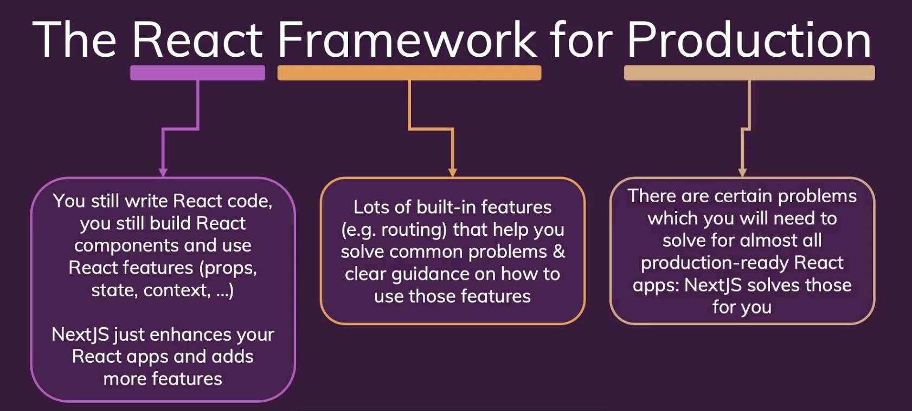

# Introducing NextJS

 

## 1) NextJS는 무엇인가
-   The React Framework for Production
-   A **fullstack** framework for ReactJS
-   프레임워크가 라이브러리보다 더 크고 기능이 많다. 프레임워크는 코드를 작성하는 방법이나 파일을 구성하는 방법에 관한 명확한 지침이 있다.
-   NextJS solves common problems and makes building React apps easier!
-   NextJS는 원래는 스스로 리액트 앱에 추가했어야 할 여러 핵심 기능들을 추가해서 React를 강화한다. (ex. 라우팅)
-   NextJS는 React 앱에 많은 기능을 간단히 추가한다. NextJS를 사용하면 쓸데없는 곳에 시간을 쏟을 필요가 없다.

 

