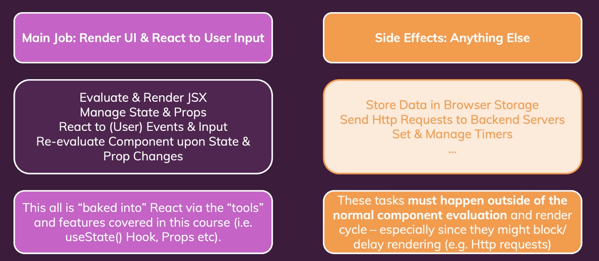
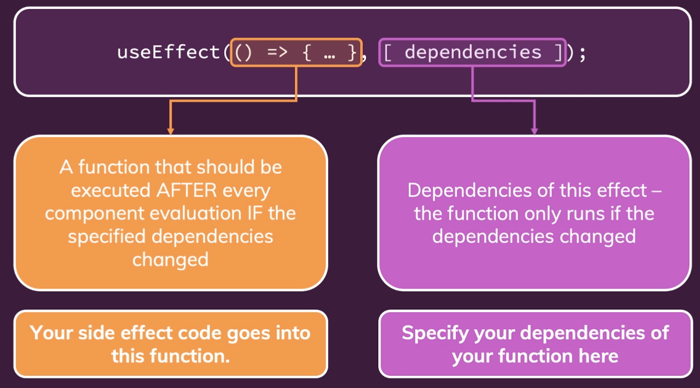

# Effects, Reducers, Context

## 1. Effects (Side Effect)



-   대부분 애플리케이션은 백엔드 서버에 http request를 보내야 한다. 이런 작업들은 화면을 렌더링하는 데 적어도 직접적인 관계는 없다.

<br>

### 1) useEffect() Hook

```javascript
useEffect(() => {...}, [dependencies])
```

-   useEffect의 첫번째 인수는 함수이다. 모든 컴포넌트 평가 후에 지정된 의존성이 변경된 경우 실행되어야 하는 함수이다.
-   두번째 인수는 지정된 의존성이다. 의존성으로 구성된 배열이다.



<br>

### 2) useEffect() with dependencies

-

```javascript
useEffect(() => {
    setFormIsValid(
        enteredEmail.includes("@") && enteredPassword.trim().length > 6
    );
}, [enteredEmail, enteredPassword]);
```
