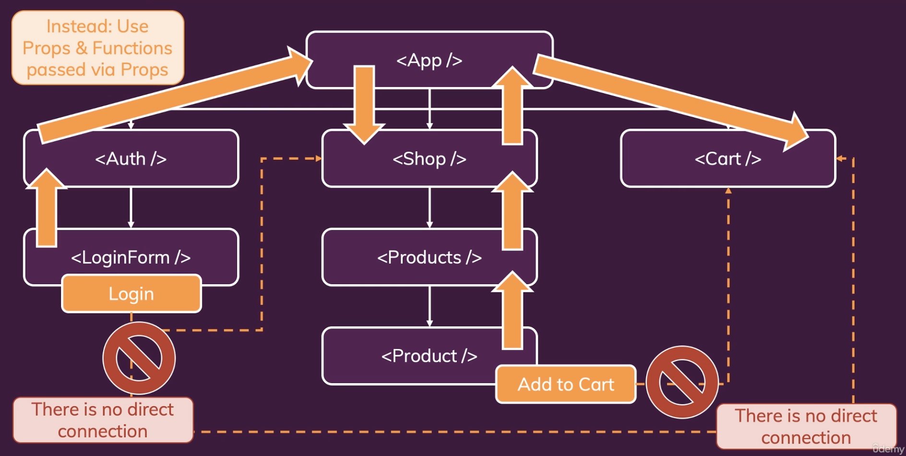

# Effects, Reducers, Context

## 1. Effects (Side Effect)


- 대부분 애플리케이션은 백엔드 서버에 http request를 보내야 한다. 이런 작업들은 화면을 렌더링하는 데 적어도 직접적인 관계는 없다.

<br>

### 1) useEffect() Hook

```javascript
useEffect(() => {...}, [dependencies])
```

- useEffect의 첫번째 인수는 함수이다. 모든 컴포넌트 평가 후에 지정된 의존성이 변경된 경우 실행되어야 하는 함수이다.
- 두번째 인수는 지정된 의존성이다. 의존성으로 구성된 배열이다.


<br>

### 2) useEffect() with dependencies

```javascript
useEffect(() => {
    setFormIsValid(
        enteredEmail.includes("@") && enteredPassword.trim().length > 6
    );
}, [enteredEmail, enteredPassword]);

// 이 컴포넌트가 처음으로 마운트 되고 렌더링 될 때만 실행됨. 이후의 렌더링 주기에는 실행되지 않음
useEffect(() => {
    console.log('EFFECT RUNNING)
},[])
```

- useEffect()에서 사용하는 모든 것을 종속성으로 추가해야 한다. 하지만 몇 가지 예외가 있다
  - 상태 업데이트 기능(setState)은 추가할 필요가 없다. (ex. setFormIsValid) React는 해당 함수가 절대 변경되지 않도록 보장하므로 종속성으로 추가할 필요가 없다.
  - 브라우저 내장 API 또는 함수(fetch()나 localStorage와 같은)를 추가할 필요가 없다. 이러한 브라우저 API / 전역 기능은 React 구성 요소 렌더링 주기와 관련이 없으며 변경되지 않는다.
  - component 외부에서 정의한 변수나 함수를 추가할 필요가 없다. 이러한 함수나 변수도 컴포넌트 함수 내부에서 생성되지 않으므로 변경해도 구성 요소에 영향을 주지 않는다.
- 즉, 다시 렌더링 되어 변경될 수 있는 경우, 그렇기 때문에 컴포넌트 함수에 정의된 state나 props 또는 함수는 종속성으로 추가되어야 한다.

<br>

```javascript
import { useEffect, useState } from "react";

let myTimer;

const MyComponent = (props) => {
  const [timerIsActive, setTimerIsActive] = useState(false);

  const { timerDuration } = props; // using destructuring to pull out specific props values

  useEffect(() => {
    if (!timerIsActive) {
      setTimerIsActive(true);
      myTimer = setTimeout(() => {
        setTimerIsActive(false);
      }, timerDuration);
    }
  }, [timerIsActive, timerDuration]);
};
```

<br>

- 위 예에서 :
  - **timeIsActive**는 dependency에 추가되었다. 왜냐하면 구성 요소가 변경될 때마다 변경될 수 있는 state이기 때문이다.
  - **timeDuration**은 dependency에 추가되었다. 왜냐하면 prop 값이기 때문에 상위 컴포넌트가 해당 값을 변경하면 변경될 수 있기 때문이다.
  - **setTimerIsActive**는 dependency에 추가되지 않았다. setState 기능은 React에서 기능 자체가 절대 변경되지 않음을 보장하므로 추가할 필요가 없다.
  - **myTimer**는 dependency에 추가되지 않았다. 왜냐하면 이것은 컴포넌트의 내부 변수가 아니다(즉, 어떤 state나 prop가 아님). 컴포넌트의 외부에서 정의되고 이를 변경한다. (어디에서든) 컴포넌트가 다시 평가되도록 하지 않는다
  - **setTimeout**은 dependency에 추가되지 않았다. 왜냐하면 브라우저 내장 API이기 때문이다. 내장 API는 React와 독립적이며 변경되지 않는다.

<br>

### 3) useEffect에서 CleanUp 함수 사용하기

- 클린업 함수는 모든 새로운 side effect 함수가 실행되기 전에, 그리고 컴포넌트가 제거되기 전에 실행된다. 단 첫번째 사이드 이펙트 함수가 실행되기 전에는 실행되지 않는다. 그러나 그 이후에는 모든 다음 사이드 이펙트 함수들이 실행되기 전에 실행된다.

- 아래 코드에서는 CleanUp 함수에 clearTimeout() 함수를 실행함으로써 클린업 함수가 실행될 때마다 클린업 함수가 실행되기 전에 설정된 타이머를 지운다.

- 따라서 다음 사이드 이펙트를 실행할 때가 되면 새로운 타이머를 설정할 수 있다. 즉 새로운 타이머를 설정하기 전에 마지막 타이머를 지운다.

<br>

```javascript
// Login.js

useEffect(() => {
  const identifier = setTimeout(() => {
    setFormIsValid(
      enteredEmail.includes("@") && enteredPassword.trim().length > 6
    );
  }, 500);

  return () => {
    clearTimeout(identifier); // 이렇게 하면 클린업 함수가 실행될 때마다 클린업 함수가 실행되기 전에 설정된 타이머를 지운다.
    console.log("CLEANUP");
  };
}, [enteredEmail, enteredPassword]);
```

<br><br>

## 2. UseReducer() for State management

- useReducer()는 state 관리를 도와준다. useState()와 약간 비슷하지만 더 많은 기능이 있고 더 복잡한 state에 특히 유용하다.
- 예를 들어 여러 state들이 함께 속해 있는 경우나 state가 다양한 방법으로 변경되는 등의 복잡한 state 관리에 유용하다. 이럴 경우 useState()를 사용하면 관리하기가 어렵고 오류가 발생하기 쉽다.
- 대부분의 경우에는 useState()를 사용하는 것이 좋다.

- 아래 코드는 prev 스냅샷을 기준으로 setState 하는게 아니기 때문에 최신 스냅샷의 데이터가 아닐 수도 있다. 아래 같은 예제는 useReducer()를 사용하는 게 좋다.

<br>

```javascript
setEmailIsValid(enteredEmail.includes("@"));

setFormIsValid(
  event.target.value.includes("@") && enteredPassword.trim().length > 6
);
```

<br>

### 1) useReducer() 사용법

- useReducer()도 useState()처럼 항상 두 개의 값이 있는 배열을 반환한다.
- **state**: 첫번째로 반환되는 값은 state 스냅샷이다. 왜냐하면 이것은 state 관리 매커니즘이기 때문이다.
- **dispatchFn**: 두번째로 반환되는 값은 state를 업데이트 할 수 있게 해주는 함수이다. 하지만 useState()와 같이 state를 업데이트 하는 게 아니라 액션을 디스패치 한다.
- **reducerFn**: 그 액션은 useReducer()의 첫번째 인수인 reducerFn이 사용한다. reducerFn은 함수이며 action이 dispatch 되면 (dispatchFn()을 통해) 자동으로 이 리듀서 함수는 호출된다. 그러면 이 함수는 리액트과 관리하는 최신 state 스냅샷을 가져온다. 또한 새로 업데이트 된 state를 반환한다.
- **initialState**: 초기 state
- **initFn**: 초기 state를 설정하기 위한 초기 함수

<br>

```javascript
const [state, dispatchFn] = useReducer(reducerFn, initialState, initFn);
```

<br>

- 먼저 enteredEmail, emailIsValid state 부터 useReducer로 관리해보자. 여기서 하려는 일은 값과 유효성을 하나의 state로 결합하여 useReducer로 관리하는 것이다.
- https://github.com/yoojh9/udemy-course-react/commit/7bc664428283377c59a60cd196676fd1ee49f649

- 위 예제처럼 enteredPassword, passwordIsValid state를 useReducer()로 사용하여 변경한 코드는 다음과 같다.

- https://github.com/yoojh9/udemy-course-react/commit/2718f248f88d8884749558c4d59cb6190f534935

<br>

### 2) useEffect() & useReducer()

- 다른 state를 기준으로 state를 업데이트 하려면 useEffect() 안에서 처리하는 것이 좋다.

- 아래 코드에서 passwordState가 최신의 state라고 보장할 수 없다.

<br>

```javascript
setFormIsValid(event.target.value.includes("@") && passwordState.isValid);
```

<br>

- useEffect()에서 dependencies에 state 를 추가하면 state가 변경될 때마다 useEffect()가 실행되므로 최신의 state를 보장할 수 있다.

<br>

```javascript
useEffect(() => {
  const identifier = setTimeout(() => {
    setFormIsValid(emailState.isValid && passwordState.isValid);
  }, 500);

  return () => {
    clearTimeout(identifier); // 이렇게 하면 클린업 함수가 실행될 때마다 클린업 함수가 실행되기 전에 설정된 타이머를 지운다.
    console.log("CLEANUP");
  };
}, [emailState, passwordState]);
```

<br>

- 하지만 위 코드는 state가 변경될 때마다 빈번하게 일어난다. 심지어 state.isValid 값이 변경될 떄가 아닌 state.val 값이 변경될 때도 실행된다.

- 아래 코드처럼 isValid가 변경될 때 useEffect()가 실행되도록 최적화해보자.

<br>

```javascript
const { isValid: emailIsValid } = emailState;
const { isValid: passwordIsValid } = passwordState;

useEffect(() => {
  const identifier = setTimeout(() => {
    setFormIsValid(emailIsValid && passwordIsValid);
  }, 500);

  return () => {
    clearTimeout(identifier); // 이렇게 하면 클린업 함수가 실행될 때마다 클린업 함수가 실행되기 전에 설정된 타이머를 지운다.
    console.log("CLEANUP");
  };
}, [emailIsValid, passwordIsValid]);
```

<br>

- https://github.com/yoojh9/udemy-course-react/commit/ec683fdef8f7330e63da8d72a91d98dc8aa6599f

<br>

### 3) useState() & useReducer()

- useState()를 사용할 경우 너무 번거로운 경우나 너무 많은 일을 처리해야 되는 경우 useReducer()를 사용한다.

- useState()

  - 메인 state 관리 툴이다. 개별 state를 다루기에 적합하다.
  - 간단한 state에 적합하다.
  - state 업데이트가 쉽고 몇 종류 안되는 경우에 적합하다.
  - 따라서 state가 변경되는 경우가 다양하지 않다면, 특히 객체 state가 아니라면 적합하다

- useReducer()
  - state가 객체이거나 복잡한 state가 있다면 useReducer()가 적합하다
  - useReducer()를 사용하면 복잡한 state 업데이트 로직을 포함하는 리듀서 함수를 사용할 수 있음
  - 연관된 state 조각들로 구성된 state 관련 데이터를 다루는 경우 유용하다.
  - useReducer 대신 useEffect()와 useState()를 같이 사용하여 처리할 수 있지만 useRedcuer()를 사용하는 것이 더 간단할 수도 있다.

<br><br>

## 3. 리액트 Context (Context API)

- props를 통해 많은 컴포넌트를 거쳐 많은 데이터를 전달할 때 문제가 일어날 수 있다.
- 현재 코드는 App 컴포넌트에서 isLoggedIn state를 관리하고 있다. 왜냐하면 이 state를 App 컴포넌트까지 올렸기 때문이다. isLoggedIn State는 여러 컴포넌트에 전달된다.

### 1) Component Trees & Component Dependencies



<br>

- 위의 스크린샷처럼 prop chain 문제를 해결하기 위해 컴포넌트 전체에서 사용할 수 있는 리액트에 내장된 내부적인 State 저장소가 있다.
- 내부적인 State 저장소가 React Context이다. 이를 사용하면 액션을 트리거할 수 있고, 그런 다음 긴 prop chain을 만들지 않고도 관련된 컴포넌트에 직접 전달할 수 있다.

<br>

### 2) 리액트 컨텍스트 사용법

- state를 앱의 어떤 컴포넌트에서든 직접 변경하여, 앱의 다른 컴포넌트에 직접 전달할 수 있게 해준다. (prop chain을 생성하지 않는다)

#### ① provider

- /store/auth-context.js

<br>

```javascript
import React from "react";

// context 객체 생성
const AuthContext = React.createContext({
  isLoggedIn: false,
});

export default AuthContext;
```

<br>

- App.js: AuthContext를 사용할 컴포넌트를 AuthContext.Provider로 컴포넌트를 생성하여 감싼다

```javascript
// App.js

return (
  <React.Fragment>
    {/* AuthContext.Provider는 컴포넌트로 AuthContext 컨텍스트가 필요한 컴포넌트들을 감쌀 수 있다. 
                모든 컴포넌트들은 AuthContext를 Wrapper로 사용하므로 AuthContext 컨텍스트에 접근할 수 있다       
            */}
    <AuthContext.Provider value={{ isLoggedIn }}>
      <MainHeader onLogout={logoutHandler} />
      <main>
        {!isLoggedIn && <Login onLogin={loginHandler} />}
        {isLoggedIn && <Home onLogout={logoutHandler} />}
      </main>
    </AuthContext.Provider>
  </React.Fragment>
);
```

#### ② listening

- 첫번째 방법: AuthContext.Consumer로 컴포넌트를 감싼다

```javascript
// Navigation.js
const Navigation = (props) => {
  return (
    <AuthContext.Consumer>
      {(ctx) => {
        return (
          <nav className={classes.nav}>
            <ul>
              {ctx.isLoggedIn && (
                <li>
                  <a href="/">Users</a>
                </li>
              )}
              {ctx.isLoggedIn && (
                <li>
                  <a href="/">Admin</a>
                </li>
              )}
              {ctx.isLoggedIn && (
                <li>
                  <button onClick={props.onLogout}>Logout</button>
                </li>
              )}
            </ul>
          </nav>
        )
      }}

    </AuthContext.Consumer>
  )
```
