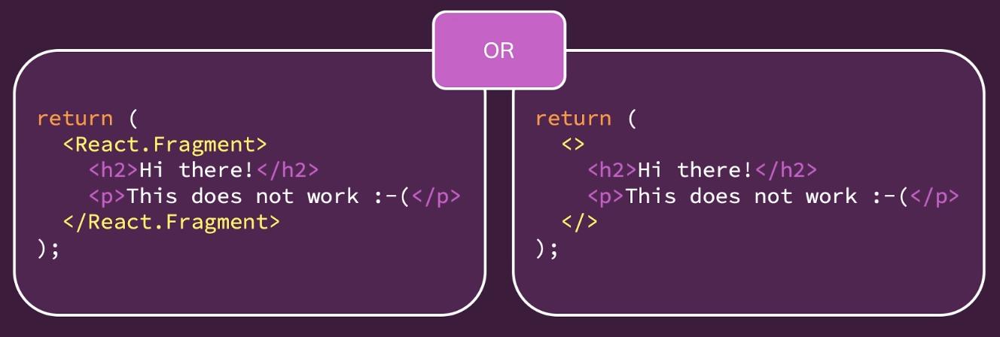
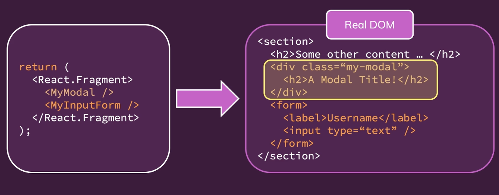
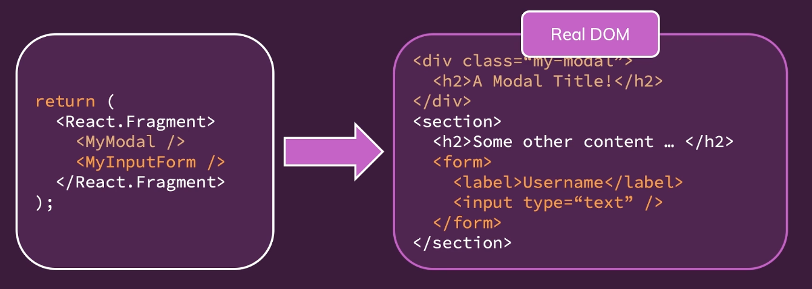

# React Advanced

## 1. JSX 제한사항 및 해결방법

### 1) JSX Limitation

-   1개 이상의 root JSX 요소는 리턴할 수 없다.

-   JSX 코드는 React.createElement 코드로 변환된다. 아래 코드처럼 자바스크립트에서는 둘 이상을 반환할 수 없다. 즉 단 하나의 React.createElement 코드만 반환되어야 한다.

<br>

```javascript
return (
    React.createElement('h2', {}, 'Hi there!');
    React.createElement('p', {}, 'This does not work :-(');
)
```

<br>

### 2) Solution (△)

-   Always Wrap Adjacent Elements

```jsx
return (
    <div>
        <h2>Hi there!</h2>
        <p>This deos not work :-(</p>
    </div>
);
```

<br>

-   하지만 \<div\>로 감싸게 되면 \"\<div\> Soup\" 라는 새로운 문제가 발생하게 된다. 이러한 불필요한 \<div\>들이 실제 DOM으로 렌더링된다. 너무 많은 HTML 요소를 렌더링하면 궁극적으로 애플리케이션은 느려질 것이다.

```javascript
<div>
    <div>
        <div>
            <div>
                <h2>Some content - yeah, this can really happen</h2>
            </div>
        </div>
    </div>
</div>
```

-   In bigger apps, you can easily end up with **tons of unnecessary <div>s** which add **no semantic meaning or structure to the page but are only there because of React's/JSX'requirement**

<br>

### 3) Solution (△)

-   children을 반환하는 root 역할만 하는 Wrapper 컴포넌트를 만든다.

```javascript
const Wrapper = (props) => {
    return props.children;
};

export default Wrapper;
```

-   위처럼 Wrapper 컴포넌트는 우리가 직접 만들 필요는 없고 리액트에서 Fragment 컴포넌트를 제공한다. 보통은 자체적으로 Wrapper 컴포넌트를 만들지 않는다.

<br><br>

## 2. Fragment 컴포넌트

### 1) Introducing Fragments



-   왼쪽 구문은 항상 작동하고 오른쪽 구문(short cut)은 빌드 워크플로가 지원해야 사용할 수 있음
-   앞에서 직접 만든 Wrapper 컴포넌트와 동일하다. 이 두 구문은 빈 Wrapper를 렌더링한다. 실제 HTML 요소를 DOM에 렌더링하지 않는다.

<br><br>

## 3. React Portals (리액트 포털)



-   semantic 관점이나 clean HTML 구조를 갖췄는지의 관점에서 보면 위 이미지 코드는 별로 좋지 않다. 왜냐햐면 기본적으로 모달은 전체 페이지에 대한 오버레이이다. 따라서 당연히 다른 모든 것들 위에 있다. 모달이 만약 다른 HTML 코드 안에 중첩되어 있다면 기술적으로 스타일링 덕분에 작동할지는 몰라도 좋은 구조가 아니다.
-   이것은 모달 뿐만이 아니라 drawer, 다이얼로그, 일반적으로 모든 오버레이와 관련된 컴포넌트에서 발생할 수 있다.

-   이것은 버튼을 만들 때 단순히 버튼처럼 \<div\> 를 스타일링하고 이벤트 리스너를 추가하는 것과 비슷하다

```javascript
<div onClick={clickHandler}>Click me, I'm a bad button</div>
```

<br>



-   이렇게 하려면 리액트 포털을 사용하면 된다.

<br>

### 1) Portal 사용 방법

-   포털에는 두 가지가 필요하다. 컴포넌트를 이동시킬 장소가 필요하고 그런 다음 컴포넌트에게 그 곳에 포털을 가져야 한다고 알려줘야 한다.
-   https://github.com/yoojh9/udemy-course-react/commit/a7eae3ef8d8a2ecd50362c367efc711b41d92e8d

<br>

#### ① /public/index.html 파일에 다음과 같이 div를 추가한다.

```html
// index.html
<body>
    <noscript>You need to enable JavaScript to run this app.</noscript>
    <div id="backdrop-root"></div>
    <div id="overlay-root"></div>
    <div id="root"></div>
</body>
```

#### ② ErrorModal.js에서 ReactDOM.createPortal()를 이용하여 Portal을 사용한다.

```javascript
// ErrorModal.js
import Card from "./Card";
import Button from "./Button";
import styles from "./ErrorModal.module.css";
import ReactDOM from "react-dom";

const Backdrop = (props) => {
    return <div className={styles.backdrop} onClick={props.onConfirm} />;
};

const ModalOverlay = (props) => {
    return (
        <Card className={styles.modal}>
            <header className={styles.header}>
                <h2>{props.title}</h2>
            </header>
            <div className={styles.content}>
                <p>{props.message}</p>
            </div>
            <footer className={styles.actions}>
                <Button onClick={props.onConfirm}>Okay</Button>
            </footer>
        </Card>
    );
};
const ErrorModal = (props) => {
    return (
        <>
            {ReactDOM.createPortal(
                <Backdrop onConfirm={props.onConfirm} />,
                document.getElementById("backdrop-root")
            )}
            {ReactDOM.createPortal(
                <ModalOverlay
                    title={props.title}
                    message={props.message}
                    onConfirm={props.onConfirm}
                />,
                document.getElementById("overlay-root")
            )}
        </>
    );
};

export default ErrorModal;
```

<br>

-   포털의 핵심은 렌더링된 HTML 내용을 다른 곳으로 옮기는 것이다.

<br><br>

## 4) ref

-   다른 DOM 요소에 접근하여 작업할 수 있게 해줌.
-   useRef()는 함수형 컴포넌트에서만 사용할 수 있다.
-   ref는 항상 객체고, current를 prop로 가지고 있다. current에는 실제 DOM 노드가 저장된다.
-   state 기반의 AddUser.js input 값을 ref로 바꿀 수 있다 (https://github.com/yoojh9/udemy-course-react/commit/e4e94fbd241105edc7f339d313a3a14ee6c11c4e)
-   값만 읽고 싶고 아무것도 바꿀 계획이 없다면 state 보다는 ref가 더 낫다.

<br><br>

## 5) 제어되는 컴포넌트 vs 제어되지 않는 컴포넌트

-   AddUser.js에서 state를 이용하여 작업했을 때는 모든 키 입력해서 해당 state를 업데이트 했다. 그리고 value prop에 state의 값을 다시 넣어줬다. 즉 state를 이용한 방식을 이용한 input 필드는 **제어되는 컴포넌트**라고 할 수 있다.
-   ref를 이용하여 상호 작용하는 컴포넌트는 **제어되지 않은 컴포넌트**가 된다. ref를 이용하여 값을 가지고 오지만 input에 다시 데이터를 보내지 않는다. AddUser.js에서 nameInputRef.current.value = ""; 를 이용하여 값을 조작하더라도 일반 DOM API를 이용하여 DOM을 조작하는 방식이므로 리액트로 이 input 요소의 state를 제어하지 않는다.
