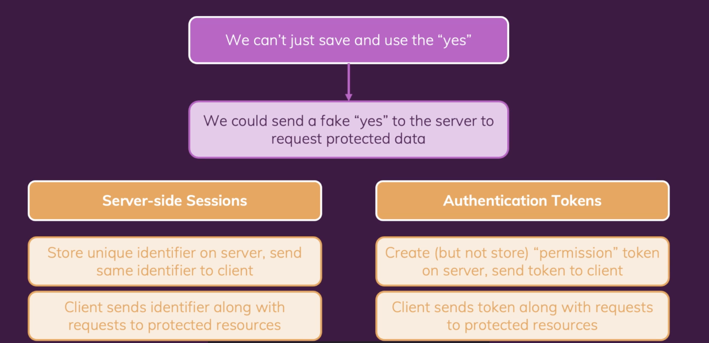

# Authentication

## 1) 2-step Process

-   Get access / permission
-   Send request to protected resource

<br><br>

## 2) How Deos Authentication Work ?



<br>

-   인증 토큰을 작업할 때, 이러한 토큰은 일반적으로 'JSON 웹 토큰'(JWT)으로 생성된다. 토큰은 실제로 데이터를 문자열로 인코딩하는 알고리즘에 의해 구성된 긴 문자열이다.(프라이빗 키의 도움으로 서버에서만 알 수 있음)

<br><br>

## 3) 설정

-   이 프로젝트에서는 Firebase Auth REST API를 사용한다.(https://firebase.google.com/docs/reference/rest/auth?hl=ko)

<br><br>

## 4) 사용자 가입 추가하기

-   https://github.com/yoojh9/udemy-course-react/commit/faeb1c8bf4f6ba8357a3b32ea5d14ef4c66cd1fb

<br><br>

## 5) 사용자 로그인 추가하기

-   https://github.com/yoojh9/udemy-course-react/commit/62f19b99b60599bef100c2136946abed3a750bd8

<br><br>

## 6) Context로 인증 State 관리하기

-   https://github.com/yoojh9/udemy-course-react/commit/4455918f1e4f64b007d64ec3082a1f31c8e27a92

<br><br>

## 7) 토큰으로 비밀번호 변경하기

-   https://github.com/yoojh9/udemy-course-react/commit/fa5590ffc0e4e620c4fd10b0eaf87a34b39c2dd2

<br><br>

## 8) 프론트엔드 페이지 보호하기
-   Navigation Guard 추가

<br>

```javascript
    <Layout>
      <Switch>
        <Route path='/' exact>
          <HomePage />
        </Route>
        {
        !authCtx.isLoggedIn && <Route path='/auth'>
          <AuthPage />
        </Route>
        }
        {
        authCtx.isLoggedIn && <Route path='/profile'>
          <UserProfile />
        </Route>
        }
        <Route path="*">
          <Redirect to="/"/>
        </Route>
      </Switch>
    </Layout>
```

<br><br>

## 9) 사용자 인증 State 유지하기
-   https://github.com/yoojh9/udemy-course-react/commit/835c10c954e9d276505bfa371f2943acf8754781

<br><br>

## 10) 자동 로그아웃 추가하기
-   https://github.com/yoojh9/udemy-course-react/commit/df0af4f2020d15440c1789504de772591802cee7