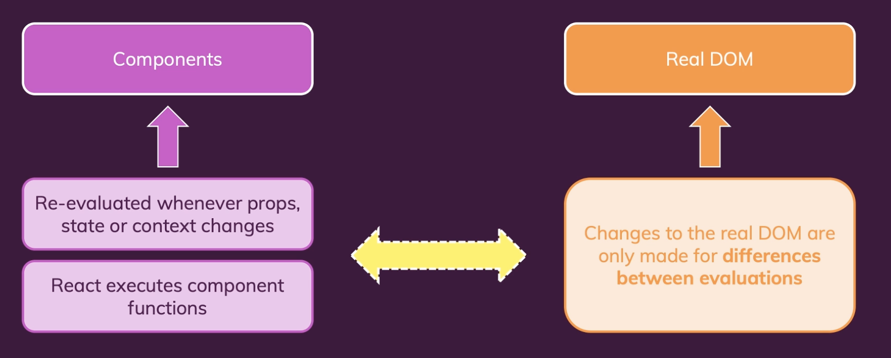
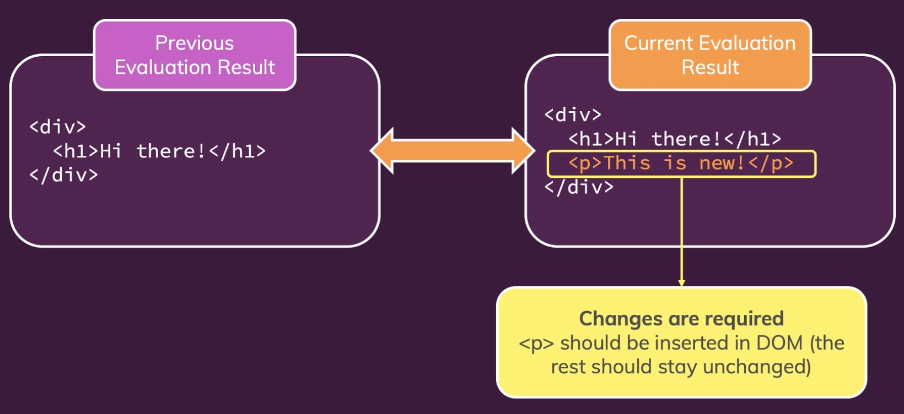

# 리액트 동작 방식과 최적화 기술

## 1. 리액트가 실제로 작동하는 방식

- 리액트는 사용자 인터페이스 구축을 위한 자바스크립트 라이브러리이다.
- 리액트의 핵심은 컴포넌트이다. 리액트는 컴포넌트를 통해 사용자 인터페이스를 구성하며 이에 대한 업데이트 역시 컴포넌트를 통해 한다.
- 리액트 DOM은 웹에 대한 인터페이스로 리액트는 웹을 모르지만 어떻게 컴포넌트를 다루는지 알고 있다. 실제 화면에 표시해주는 역할은 ReatDOM이 한다.
- 리액트는 컴포넌트를 관리하고 state 객체를 관리하고, 또한 다른 객체의 상태와 컴포넌트가 바뀌어야 하는지를 확인하고 컴포넌트의 변경 전후의 상태를 확인하는 라이브러리일 뿐이다.
- 리액트는 변경된 내용과 어떤 화면이든간에 화면에 표시되어야 할 정보 모두를 현재 사용중인 인터페이스에 전달한다. 예를 들면 ReactDOM과 같은 인터페이스에 전달한다. 리액트 DOM은 브라우저의 일부인 실제 DOM에 대한 작업을 하므로 사용자가 보고 있는 화면에 무언가를 표시하는 역할은 React DOM의 몫이다.
- 리액트는 컴포넌트만 신경 쓴다. 리액트는 props를 관리한다. props는 컴포넌트에 전달하는 데이터로 컴포넌트 구성을 가능하게 해주고 부모-자식 컴포넌트간의 통신을 연결해준다. 그리고 리액트는 컴포넌트 내부의 데이터인 State를 다룬다. 또 컴포넌트 전체의 데이터인 Context도 다룬다.
- props, state 또는 context가 변경 되면 이런 것들을 사용하는 컴포넌트 역시 리액트를 통해 변경되고, 리액트는 이 컴포넌트가 화면에 새로운 것을 표시하는지에 대해 확인을 한다. 이렇게 화면에 뭔가를 그리려고 한다면 리액트는 리액트 DOM에 알려 리액트 DOM이 새로운 화면과 새로운 컴포넌트 그리고 새로운 output을 표시할 수 있게 해준다.

 

 

- 리액트는 컴포넌트를 다루며 리액트는 가상 DOM 이라는 개념을 사용한다. 이 가상 DOM은 앱이 마지막에 만들어내는 컴포넌트 트리를 결정한다. 각각 하위 트리를 갖고 있는 컴포넌트들은 JSX 코드를 반환하는데 이 가상 DOM은 컴포넌트 트리의 현재 모양과 최종 모양을 정한다. 
- 가령, 상태가 업데이트 되면 이 정보는 리액트 DOM으로 전달되어 갱신 전후의 상태 차이를 인식하고 리액트가 컴포넌트 트리를 통해 구성한 가상 스냅샷인 가상 DOM과 일치하도록 실제 DOM을 조작하는 방법을 알 수 있게 한다.

- state, props, context, 컴포넌트에 변경이 발생하면 컴포넌트 함수가 재실행되어 리액트가 이를 재평가하게 된다.

  

### Re-Evaluating Components !== Re-Rendering the DOM

 

- Re-Evaluate가 DOM을 다시 랜더링하는 것을 의미하지는 않는다. 리액트에 의해 컴포넌트 함수가 재실행된다고 해서 실제 DOM의 각 부분들이 다시 랜더링된다거나 재평가되는 것은 아니다.
- 컴포넌트 부분과 리액트 부분, 그리고 실제 DOM을 구분할 줄 알아야 한다. 
- 컴포넌트는 state, props, context가 변경될 때 재평가된다. 이러면 리액트는 컴포넌트 함수를 다시 실행한다. 
- 한편, 이에 반해 실제 DOM은 리액트가 구성한 컴포넌트의 이전 상태와 트리, 그리고 현재 상태간의 차이점을 기반으로 변경이 필요할 때만 업데이트 된다.
- 즉, 실제 DOM은 필요한 경우에만 변경된다. 이전과 현재 상태를 가상으로 비교한다는 것은 간편하고 자원도 적게 든다. 이 작업은 메모리 안에서만 발생하기 때문이다.
- 이렇게 리액트는 가상 DOM과의 비교를 통해 최종 스냅샷과 현재의 스냅샷을 실제 DOM에 전달하는 구조를 갖는다. 가상 DOM을 통해 2개의 스냅샷 간의 차이점을 알아낸다. 

 

- 이렇듯 리액트는 전체 DOM을 다시 렌더링하지 않는다.

  

## 2. 컴포넌트 업데이트
- state, props, context 변화는 컴포넌트 함수를 다시 실행시킨다. 하지만 실제 DOM은 가상 스냅샷 간의 차이점만 반영된다.
- 부모 컴포넌트 함수가 업데이트 되면 자식 컴포넌트 함수도 재실행된다.
- 부모 컴포넌트가 변경되면 자식 컴포넌트들이 재실행, 재평가된다. 
- 이렇게 되면 연결된 모든 자식 컴포넌트가 재실행되고 재평가되면 굉장히 많은 함수가 가상 비교되는데 성능에 영향을 미치지 않을까라는 걱정을 할 수도 있지만 사실은 그렇지 않다. 

  

