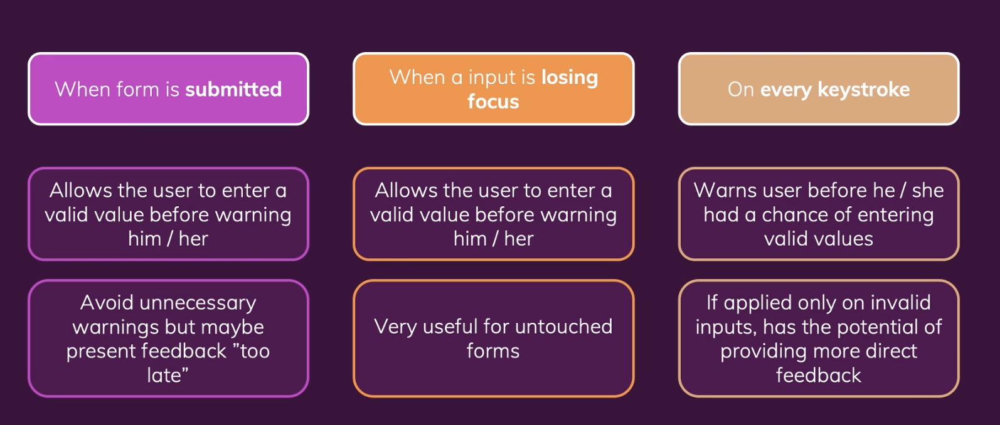

# Handling Forms & User Input

## 1) When To Validate?



<br><br>

## 2) 양식 제출 처리 및 사용자 입력 값 가져오기

- input 값을 읽어오기 위해 useState나 useRef를 이용할 수 있다.
- 만약 폼이 제출될 때 input 값이 한번만 필요하다면 useRef가 낫다. 모든 키 입력마다 state 값을 업데이트 하기에는 조금 지나치고 불필요하다.
- 반면 즉각적인 유효성 검증을 위해 키 입력마다 입력 값이 필요하다면 ref로는 이 작업이 불가능하므로 useState를 사용하는 것이 좋다.
- 또한 폼 제출 후 입력된 값을 초기화 하기에도 useState()가 적합하다. useRef()로 초기화 하는 것은 바닐라자바스크립트를 이용하여 DOM을 직접 조작하게 되므로 보통 지양해야 하는 방법이다. DOM 조작은 리액트를 사용한다.

<br><br>

## 3) 기본 검증 추가 및 검증 피드백 제공하기

- https://github.com/yoojh9/udemy-course-react/commit/8ad60553ccbd8ffd41ce82da7820bd3d05a79497

<br><br>

## 4) "was touched" State 처리하기
- https://github.com/yoojh9/udemy-course-react/commit/b3af2f7acac044da070668da82265fd93299c74b

<br><br>

## 5) 리팩토링
- https://github.com/yoojh9/udemy-course-react/commit/9b4727a1ab89faf0a703e497bf1cb42df6529ebe

<br>

```javascript
// SimpleInput.js

import { useState } from "react";

const SimpleInput = (props) => {
  const [enteredName, setEnteredName] = useState("");
  const [enteredNameTouched, setEnteredNameTouched] = useState(false);

  const enteredNameIsValid = enteredName.trim() !== "";
  const nameInputIsInValid = !enteredNameIsValid && enteredNameTouched;

  const nameInputChangeHandler = (event) => {
    setEnteredName(event.target.value);
  };

  const nameInputBlurHandler = (event) => {
    setEnteredNameTouched(true);
  };

  const formSubmissionHandler = (event) => {
    event.preventDefault();

    setEnteredNameTouched(true);

    if (enteredName.trim() === "") {
      return;
    }
    // nameInputRef.current.value = ''; => NOT IDEAL. DON'T MANIPULATE THE DOM
    setEnteredName("");
    setEnteredNameTouched(false);
  };

  const nameInputClasses = nameInputIsInValid
    ? "form-control invalid"
    : "form-control";

  return (
    <form onSubmit={formSubmissionHandler}>
      <div className={nameInputClasses}>
        <label htmlFor="name">Your Name</label>
        <input
          value={enteredName}
          type="text"
          id="name"
          onChange={nameInputChangeHandler}
          onBlur={nameInputBlurHandler}
        />
        {nameInputIsInValid && (
          <p className="error-text">Name must not be empty.</p>
        )}
      </div>
      <div className="form-actions">
        <button>Submit</button>
      </div>
    </form>
  );
};

export default SimpleInput;

```

<br><br>

## 6) 전체 양식 유효성 관리하기

- https://github.com/yoojh9/udemy-course-react/commit/bcd6c5c378b6089e32fc351e2482bbbddd2e192e

<br>

```javascript
// SimpleInput.js
import { useState } from "react";

const SimpleInput = (props) => {
  const [enteredName, setEnteredName] = useState("");
  const [enteredNameTouched, setEnteredNameTouched] = useState(false);

  const enteredNameIsValid = enteredName.trim() !== "";
  const nameInputIsInValid = !enteredNameIsValid && enteredNameTouched;

  let formIsValid = false;
  if(enteredNameIsValid) {
    formIsValid = true
  }

  const nameInputChangeHandler = (event) => {
    setEnteredName(event.target.value);
  };

  const nameInputBlurHandler = (event) => {
    setEnteredNameTouched(true);
  };

  const formSubmissionHandler = (event) => {
    event.preventDefault();

    setEnteredNameTouched(true);

    if (enteredName.trim() === "") {
      return;
    }
    // nameInputRef.current.value = ''; => NOT IDEAL. DON'T MANIPULATE THE DOM
    setEnteredName("");
    setEnteredNameTouched(false);
  };

  const nameInputClasses = nameInputIsInValid
    ? "form-control invalid"
    : "form-control";

  return (
    <form onSubmit={formSubmissionHandler}>
      <div className={nameInputClasses}>
        <label htmlFor="name">Your Name</label>
        <input
          value={enteredName}
          type="text"
          id="name"
          onChange={nameInputChangeHandler}
          onBlur={nameInputBlurHandler}
        />
        {nameInputIsInValid && (
          <p className="error-text">Name must not be empty.</p>
        )}
      </div>
      <div className="form-actions">
        <button disabled={!formIsValid}>Submit</button>
      </div>
    </form>
  );
};

export default SimpleInput;

```