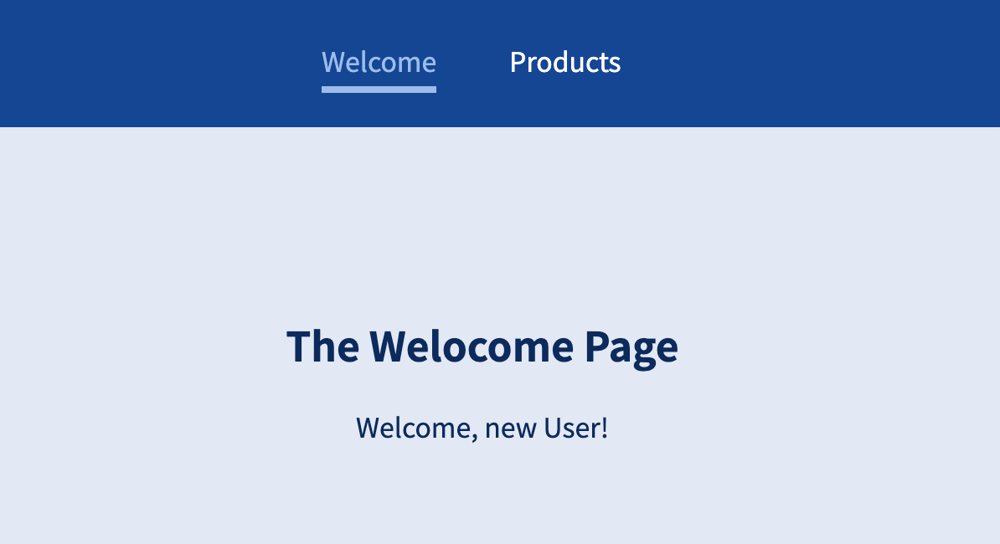

# React Router

## 1) Building SPAs

-   사용자가 웹 사이트를 처음 방문할 때 페이지는 하나이며, 자바스크립트를 사용하여 도메인 뒤에 URL과 해당 경로를 조작할 수 있다.
-   또한 URL이 변경되어도 기존 서버렌더링처럼 새 HTML 파일을 가져오지 않고 링크를 클릭할 때 화면에 표시되는 내용을 변경하는 클라이언트 사이드(React Code)를 사용한다.
-   실제로 새 HTML 파일에 대한 요청을 서버에 보내지 않고 리액트가 포함된 클라이언트 사이드 javascript로 화면에 표시되는 내용을 업데이트 한다.

<br><br>

## 2) React Router 설치하기

-   클라이언트 사이드 라우팅을 지원하는 React Router 패키지를 설치한다.
-   라우팅이란 서로 다른 URL, 즉 URL의 여러 경로로 서로 다른 페이지를 로드할 수 있는 기능이다.

<br>

```javascript
$ npm install react-router-dom@5
```

<br><br>

## 3) React Router 사용하기

-   index.js파일에 <App> 컴포넌트를 <BrowserRouter>가 래핑하도록 추가한다.

<br>

```javascript
import ReactDOM from "react-dom/client";
import { BrowserRouter } from "react-router-dom";

import "./index.css";
import App from "./App";

const root = ReactDOM.createRoot(document.getElementById("root"));
root.render(
    <BrowserRouter>
        <App />
    </BrowserRouter>
);
```

<br>

-   App.js에 라우터를 추가해보자

<br>

```javascript
import { Route } from "react-router-dom";
import Products from "./pages/Products";
import Welcome from "./pages/Welcome";

function App() {
    return (
        <div>
            <Route path="/welcome">
                <Welcome />
            </Route>
            <Route path="/products">
                <Products />
            </Route>
        </div>
    );
}

export default App;
```

<br><br>

## 4) \<Link\> 사용하기

-   react-router-dom 의 \<Link/\> 컴포넌트를 이용하면 \<a> 태그의 href와 다르게 화면 전체가 새로고침 되지 않는다. \<Link\> 태그는 같은 페이지 안에 머물게 하고, React 어플리케이션이 전체 페이지를 re-render 하지 않게 하고 변경되는 컴포넌트만 렌더한다. 이는 네비게이션을 좀 더 빠르고 부드럽게 처리되도록 만들어준다.
-   반면 \<a\> 태그의 href는 전체 페이지를 reload 하고 네비게이션 성능이 느려질 수 있다.

<br>

```javascript
// Mainheader.js

import { Link } from "react-router-dom";

const Mainheader = () => {
    return (
        <header>
            <nav>
                <ul>
                    <li>
                        <Link to="/welcome">Welcome</Link>
                    </li>
                    <li>
                        <Link to="/products">Products</Link>
                    </li>
                </ul>
            </nav>
        </header>
    );
};

export default Mainheader;
```

<br><br>

## 5) \<NavLink\> 사용하기

-   \<NavLink\>는 \<Link\>의 더 개선된 버전으로 'activeClassName' prop 등을 더 사용할 수 있어 active 라우트와 inactive 라우트를 더 구별하기 쉽게 해준다.

<br>

```javascript
import { NavLink } from "react-router-dom";
import classes from "./Mainheader.module.css";

const Mainheader = () => {
    return (
        <header className={classes.header}>
            <nav>
                <ul>
                    <li>
                        <NavLink activeClassName={classes.active} to="/welcome">
                            Welcome
                        </NavLink>
                    </li>
                    <li>
                        <NavLink
                            activeClassName={classes.active}
                            to="/products"
                        >
                            Products
                        </NavLink>
                    </li>
                </ul>
            </nav>
        </header>
    );
};

export default Mainheader;
```

<br><br>

## 6) route 구성에 "Switch" 및 "exact" 사용하기

-   아래 라우터에서 /product/p2를 호출하면 \<Products\> 컴포넌트와 \<ProductDetail\> 컴포넌트 둘 다 보이게 됨. 해당 URL은 /product로 시작하기도 하므로 두 라우트가 모두 활성화된다.

```javascript
import React from "react";
import { Route } from "react-router-dom";
import Mainheader from "./components/Mainheader";
import ProductDetail from "./pages/ProductDetail";
import Products from "./pages/Products";
import Welcome from "./pages/Welcome";

function App() {
    return (
        <div>
            <Mainheader />
            <main>
                <Route path="/welcome">
                    <Welcome />
                </Route>
                <Route path="/products">
                    <Products />
                </Route>
                <Route path="/products/:productId">
                    <ProductDetail />
                </Route>
            </main>
        </div>
    );
}

export default App;
```

<br>

### (1) Switch

-   이 경우에 react-router-dom의 \<Switch\> 컴포넌트를 사용하면 된다. 하지만 Switch는 가장 먼저 매칭되는 라우트가 보여지므로, /product/:productId URL로 접근해도 ProductDetail 컴포넌트는 더이상 표시되지 않는다. 리액트 라우터는 그저 라우트를 위에서 아래로 통과할 뿐이기 때문이다. 그리고 매칭되는 항목을 찾는다는 것은 전체 경로가 아니라 경로의 시작 부분과 일치할 때를 의미한다.
-   그래도 Switch를 사용하면 하나의 라우트만 활성화시킬 수 있다.

<br>

### (2) exact

-   한가지 해결책은 라우트 순서를 변경하는 것이다. /products/:productId 라우트를 /products 라우트보다 위에 두는 것이다.

-   두번째 해결책은 exact prop을 추가하는 것이다. 이 prop은 리액트 라우터에 URL이 정확히 일치하는 경우에만 일치 여부를 알려준다.

<br><br>

## 7) Nested Route 사용하기

-   한 곳에서만 라우트를 정의하는 것이 아니라 원하는 곳 어디에서나 라우트를 정의할 수 있다.

<br>

```javascript
// App.js
function App() {
    return (
        <div>
            <Mainheader />
            <main>
                <Switch>
                    <Route path="/welcome">
                        <Welcome />
                    </Route>
                    <Route path="/products" exact>
                        <Products />
                    </Route>
                    <Route path="/products/:productId">
                        <ProductDetail />
                    </Route>
                </Switch>
            </main>
        </div>
    );
}
```

<br>

```javascript
import { Route } from "react-router-dom/cjs/react-router-dom";

const Welcome = () => {
    return (
        <section>
            <h1>The Welocome Page</h1>
            <Route path="/welcome/new-user">
                <p>Welcome, new User!</p>
            </Route>
        </section>
    );
};

export default Welcome;
```

-   /welcome/new-user로 접속하게 되면 아래 화면처럼 /welcome 라우트와 /welcome/new-user 라우트가 모두 활성화 되는 것을 확인할 수 있다

<br>



<br><br>

## 8) 사용자 리다이렉션

```javascript
<Route path="/" exact>
    <Redirect to="/welcome" />
</Route>
```

<br><br>
