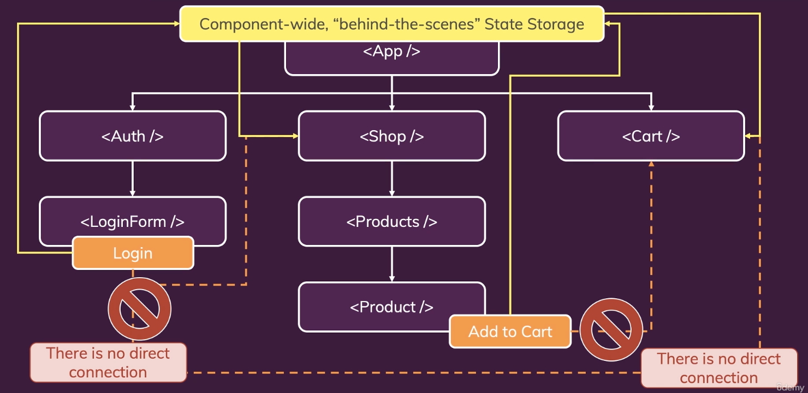
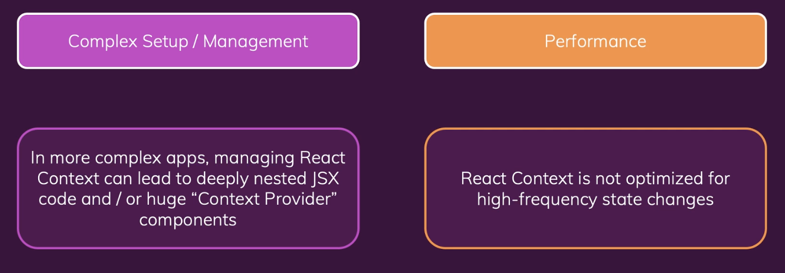
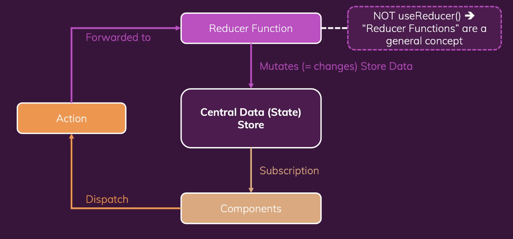
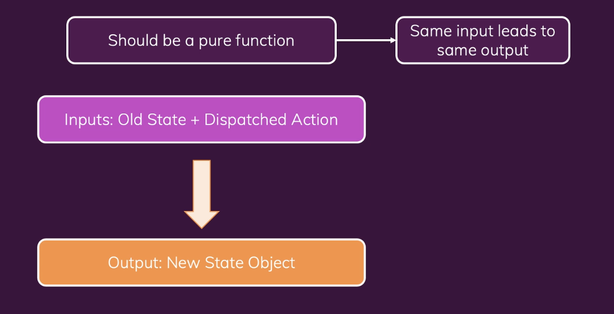

# Redux에 뛰어 들기 (Context API의 대안)

-   What is Redux ? And Why?
-   Redux Basics & Using Redux with React
-   Redux Toolkit

<br><br>

## 1) What is 'Redux'?

-   A state management system for cross-component or app-wide state

<br>

### (1) What is Cross-Component / App-Wide State?


<br>

### (2) React Context

-   리액트 Context는 리액트의 내장 기능이고 Cross-Component State나 App-Wide State를 쉽게 관리하도록 해준다.



<br>

-   Redux도 역시 같은 문제를 해결해준다.
-   즉 리액트 Context와 Redux는 모두 cross-component state와 app-wide state를 관리하도록 도와준다.
-   그럼 Context가 이미 있는데 왜 Redux가 필요할까?

<br><br>

## 2) What is "Redux"?

-   A state management system for cross-component or app-wide state

<br>

### (1) React Context의 잠재적인 단점

-   Complext Setup / Management
    -   리액트 컨텍스트를 사용하면 설정이나 관리가 아주 복잡해질 수 있다.
    -   리액트 컨텍스트를 사용하여 대형 어플리케이션을 결국 이런 코드가 나올 수 있다.

<br>

```javascript
return (
    <AuthContextProvider>
        <ThemeContextProvider>
            <UIInteractionContextProvider>
                <MultiStepFormContextProvider>
                    <UserRegistration />
                </MultiStepFormContextProvider>
            </UIInteractionContextProvider>
        </ThemeContextProvider>
    </AuthContextProvider>
);
```

<br>

-   Performance
    -   데이터가 자주 변경되는 경우 Context는 좋지 않다.

<br>



<br><br>

## 3) Redux 작동 방식

-   리덕스는 하나의 **Central Data(State) Store**(중앙 데이터 저장소)이다.
-   그 하나의 저장소에 전체 애플리케이션의 모든 상태를 저장한다.

<br>

<br>

-   컴포넌트는 절대로 저장된 데이터를 직접 조작하지 않는다. 그래서 subscription을 하는 것이고 데이터는 절대로 반대 방향으로 흐르지 않는다.
-   그 대신에 Reducer라는 개념을 이용한다. Reducer 함수는 변형을 담당한다. 즉 저장소 데이터를 변경하는 것을 담당한다. 여기서 주의해야 할 점은 Reducer 함수의 개념은 useReducer() 훅과는 전혀 관련이 없다는 점이다.
-   Reducer 함수는 input을 받아 input을 변환하고 줄이는 함수이다. 예를 들면 숫자로 된 리스트를 그 숫자의 합으로 줄일 수 있다. 일반적으로 Reducer 함수는 입력을 변환해서 새로운 출력, 새로운 결과를 만든다.
-   우리는 action이 있고 컴포넌트는 action을 dispatch 한다. 그래서 컴포넌트가 어떤 액션을 trigger 한다고 말할 수도 있다. 액션은 사실 단순히 자바스크립트 객체이다. 그 객체가 리듀서가 실행해야 할 작업을 설명하게 된다. 그래서 Redux는 그 액션을 Reducer로 전달하고 그 작업을 Reducer가 수행하게 된다.
-   그리고 나서 Reducer는 새로운 State를 반환하고 그게 실제로 중앙 데이터 저장소의 기존 상태를 대체하게 된다.
-   데이터 저장소의 state가 변경되면 구독 중인 컴포넌트가 알림을 받게 되고 컴포넌트는 UI를 업데이트 할 수 있게 된다.

<br>

### (1) Reducer Function

-   리듀서 함수는 표준 자바스크립트 함수지만 리덕스 라이브러리에 의해 호출될 것이다. 리듀서 함수는 항상 2개의 파라미터를 받는다. 바로 기존의 state와 dispatched된 action을 받는다. 그리고 이 리듀서 함수는 항상 새로운 state 객체를 리턴해야만 한다.

<br>

<br>

-   Redux 기본 예제

```javascript
const { configureStore } = require("@reduxjs/toolkit");

const counterReducer = (state = { counter: 0 }, action) => {
    return {
        counter: state.counter + 1,
    };
};

// const store = redux.createStore() // legacy
const store = configureStore({
    reducer: counterReducer,
});

const counterSubscriber = () => {
    const latestState = store.getState();
    console.log(latestState);
};

// 리덕스는 데이터 저장소가 변경될 때마다 couterSubscriber()를 실행시켜 준다.
store.subscribe(counterSubscriber);

store.dispatch({ type: "increment" });
```
