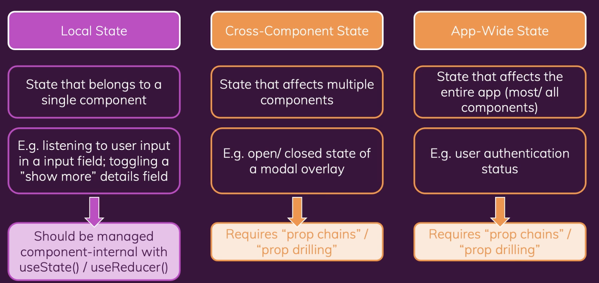

# Redux에 뛰어 들기 (Context API의 대안)

-   What is Redux ? And Why?
-   Redux Basics & Using Redux with React
-   Redux Toolkit

<br><br>

## 1) What is 'Redux'?

-   A state management system for cross-component or app-wide state

<br>

### (1) What is Cross-Component / App-Wide State?



<br>

### (2) React Context

-   리액트 Context는 리액트의 내장 기능이고 Cross-Component State나 App-Wide State를 쉽게 관리하도록 해준다.


<br>

-   Redux도 역시 같은 문제를 해결해준다.
-   즉 리액트 Context와 Redux는 모두 cross-component state와 app-wide state를 관리하도록 도와준다.
-   그럼 Context가 이미 있는데 왜 Redux가 필요할까?

<br><br>

## 2) What is "Redux"?

-   A state management system for cross-component or app-wide state

<br>

### (1) React Context의 잠재적인 단점

-   리액트 컨텍스트를 사용하면 설정이나 관리가 아주 복잡해질 수 있다.
-   리액트 컨텍스트를 사용하여 대형 어플리케이션을 결국 이런 코드가 나올 수 있다.

<br>

```javascript
return (
    <AuthContextProvider>
        <ThemeContextProvider>
            <UIInteractionContextProvider>
                <MultiStepFormContextProvider>
                    <UserRegistration />
                </MultiStepFormContextProvider>
            </UIInteractionContextProvider>
        </ThemeContextProvider>
    </AuthContextProvider>
);
```

<br>

-   성능: 데이터가 자주 변경되는 경우 Context는 좋지 않다.

<br>


